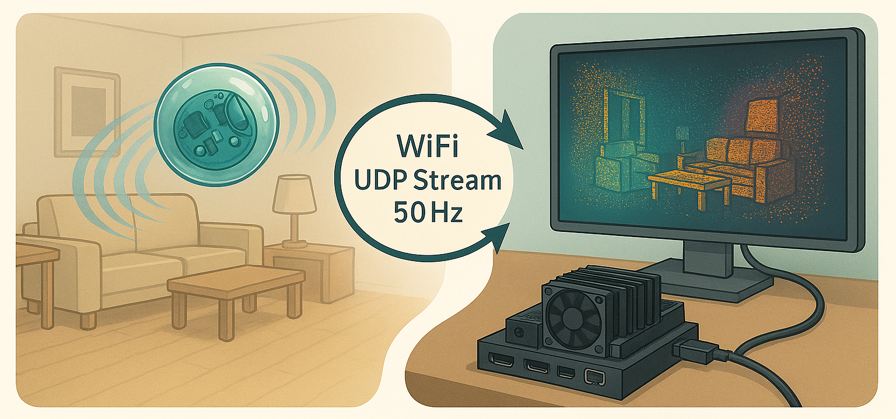

# 🐦‍⬛ Hugin 🏀
### *A useful toy for mapping your living room*


---

This is an **OpenHardware project** for makers or makers to be. Hopefully you will look through
these project files and think, *"I could build that!"* 💡
And hopefully, you will love how simple it is, yet so powerful.

> 🐦‍⬛ **Hugin** is the messenger raven for the norse god Odin, which returns information
> about the state of the world to the king of the Gods.
>
> In the same manner, Hugin will map the environment that it is flying and
> bouncing through, and return that data to you, as you wield your domestic laptop
> power. 💻

Attach your optional sensors to the vacant mounts on the ball and use it as a platform for exploratory play. 🔬

---

## 🔧 Use what you have.

As a default design we make the ball with a **Raspberry Pi Pico W** inside, appropriate
sensors and a battery. For the base station we will use a **Jetson Orin Nano Super Developer Kit**. Since this is components I had at hand.

Please contribute with your own configuration, if you get another combination of parts to work. 🤝


---

## 📦 What the project is.

- ✨ An idea and tested concept.
- 📐 Blueprint for the ball
    - 🖨️ 3D prints with mounts for MCU and sensors.
    - 🐍 Python code for base station server.
- 👥 A platform for collaboration

---

## 🚀 Let's get started. You'll be throwing the ball in a weekend!

**💬 Please join our Slack channel** [LINK]

**📥 Please clone the repos**
```bash
git clone https://github.com/rasmusravn/hugin.git
```

and run the getting started script.

```bash
chmod +x getting_started.sh
./getting_started.sh
```

> **📝 NOTE:** This will help you set up the project with personalizations. It uses
> `cookiecutter` under the hood. It will create set of files in the folder
> `/my_build` and guide you through populating the build.

After running the `./getting_started.sh`-script. Please keep running the script
```bash
./next_step.sh
```
Everytime you are ready to work on the construction of your own Hugin again.

---

**🎉 Happy building, and happy throwing! 🎯**
